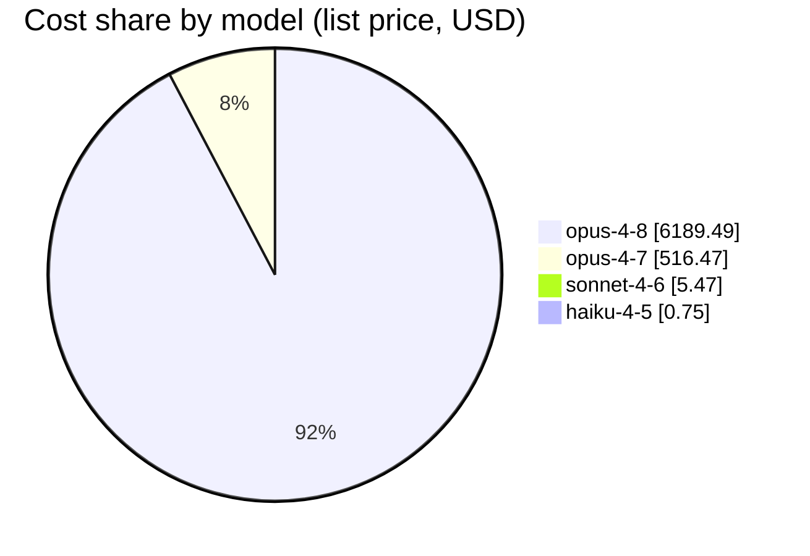
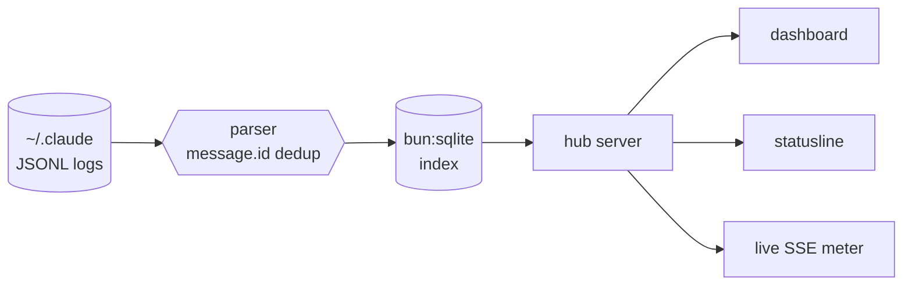

# tokana — where your tokens actually go

**A local, offline lens on your Claude Code usage.** No API key, no network, no cloud dashboard. tokana reads the session transcripts already sitting on your disk and tells you the truth about your tokens — down to the token — including the *actual content* that filled your context window.

<!-- Numbers below are a real snapshot from the author's own machine. Reproduce yours with `bun run index`. -->

---

## Why this exists

Every long session with an AI coding agent ends the same way: a number appears. A token count. A "you're approaching your limit" nudge. And you have no idea where it came from. The conversation felt lightweight — the bill says otherwise — and between the two sits a black box you're paying to keep closed.

That gap is where the money hides. You can't optimize what you can't see, so you either overpay in silence or start ripping out MCP servers at random hoping the number drops.

tokana cracks the box open and shows you the real math — not an estimate, the actual breakdown of every turn: what was your conversation, and what was standing scaffolding you re-send on *every single request*.

The results are uncomfortable in the best way. In one real turn, **65% of the input was tool + skill scaffolding** — system prompt, tool schemas, skill definitions — not the conversation you actually had. Your typed message was **0.2%**. And on the flip side, the relief: caching quietly absorbed **81% of the cost** across the author's history — **$31,952 saved** — by a mechanism you never watched work.

Seeing the numbers changes what you do next.

## A real snapshot from one machine

| | |
|---|---|
| Turns | **14,191** |
| Sessions | 99 |
| Projects | 66 |
| Total tokens | **2,593,521,328** |
| Cache reads | 2,458,435,417 (95% of all tokens) |
| Output tokens | 10,346,854 |
| List-price cost (API-equivalent) | **$7,419.22** |
| Cost without caching | $39,371.67 |
| **Saved by caching** | **$31,952.46 (81.2%)** |
| Index time | 1,230 files, first run ~1s; incremental re-index **0.2s** |

On Claude **Max**, the *actual* marginal cost of all of the above is **$0** — the list price is the counterfactual ("what this would cost on the API"), not your invoice. tokana shows both, labeled, and the multiplier is configurable in `pricing.json`.

## The dedup lie (why most token counters are wrong)

**Claude Code writes one JSONL line per content block** — and every line for one assistant turn repeats the *same* `usage` object. A single response with a thinking block, a text block, and three tool calls is five lines, each carrying the full token count. Sum the lines naively and you overcount by 3–4×.

One real turn from the author's data:

| | Output tokens |
|---|---|
| Naive line-sum | 103,482 |
| Deduped by `message.id` | 30,367 |
| **Inflation** | **3.4×** |

tokana deduplicates by `message.id` before counting anything. This isn't a heuristic — it's verified. `bun run verify` does an **independent re-count** from the raw transcripts (a second implementation) and agrees with the ledger **to the token**. If a tool's numbers don't survive that check, they're fiction.

## What it shows you

Most tools give you one number. tokana separates two things that are constantly confused because they answer different questions.

### 1. Billing buckets — what you're *charged* for

Every input token lands in exactly one price tier:

```text
Token accounting across 2.59B tokens · 99 sessions · 66 projects

cache-read   ████████████████████████████████████████████████  2.46B  (94.8%)
uncached in  ▍                                                  19.0M  ( 0.7%)
output       ▏                                                  10.3M  ( 0.4%)

  list cost (API-equivalent)          $ 7,419.22
  no-cache cost (naive counterfactual) $39,371.67
  ──────────────────────────────────────────────
  saved by caching                    $31,952.46   ▓▓▓▓▓▓▓▓▓▓▓▓▓▓▓▓ 81.2%
```

| Bucket | Multiplier |
|---|---|
| Uncached input | 1× |
| Cache write (5m) | 1.25× |
| Cache write (1h) | 2× |
| Cache read | 0.1× |
| Output | (output rate) |

Cost by model, from the same history:



### 2. Content attribution — what's actually *in* the tokens

Billing tells you the tier. It doesn't tell you *what filled the context window*. tokana breaks a turn's input into: your message / conversation history / tool results / thinking / files / and the system+tools baseline — and for every visible segment it shows the **actual (secret-redacted) content**, so you can literally read what's in your window next to its token count.

A real 149,827-token input, attributed:

```text
What actually fills the context window on a single turn:

baseline (system + tools)  ██████████████████████████████████  65.0%
history (prior messages)   ████████▌                           16.0%
tool results               █████▊                              11.0%
padding / other            ████▏                                7.8%
YOUR message               ▏                                    0.2%   (364 tokens)

  You type 0.2% of the tokens. The other 99.8% is the machinery.
```

The system+tools baseline is the one segment with **no content to show** — Claude Code doesn't store the system prompt or tool schemas in the transcript, so tokana reports it as a **truth-bearing residual** (total input minus everything visible) and refuses to fabricate content it can't see.

There's a **live SSE meter** in the dashboard that updates as sessions run, plus a **statusline** you can drop straight into Claude Code (below).

## Secret-safe by design

The content view can surface anything that was in your context — including credentials in tool output. Before display, every segment passes through a redaction layer that masks Anthropic / OpenAI (incl. `sk-proj-`) / Stripe / GitHub / GitLab / AWS / Google / Slack / Azure / SendGrid / HuggingFace keys, JWTs, Bearer tokens, PEM private keys, and database connection strings with embedded passwords — so a screenshot never leaks a live key. (Hardened by an adversarial redaction audit; it errs toward over-masking.)

## Architecture



The stack is deliberately boring: **Bun + TypeScript + `bun:sqlite` + a vanilla-JS dashboard.** No framework, no build step, no telemetry. Your transcripts never leave the machine.

## Exact vs approximate

tokana refuses to blur the line between what it *knows* and what it *estimates*.

| Thing | Status | Why |
|---|---|---|
| Total token counts | **Exact** | Read directly from Claude's `usage` field |
| Dedup by `message.id` | **Exact** | Verified by independent re-count (`bun run verify`) |
| Billing buckets & multipliers | **Exact** | Bucketed from the recorded `usage` breakdown |
| Cache savings | **Exact** | Full-price counterfactual vs recorded reads |
| List-price cost | **Exact** | usage × published per-token rates (editable `pricing.json`) |
| Content segmentation (msg / history / tools / files) | **Approximate** | Claude's tokenizer isn't public — segmentation uses a **cl100k proxy** |
| System+tools baseline | **Residual** | Inferred (total input minus visible), not stored — no content exists to show |

One honest sentence: **the counts are exact; the split of tokens *within* a turn is a good approximation, and tokana labels it as such everywhere it appears.**

## Quick start

Requires [Bun](https://bun.sh). Nothing else — no key, no account, no outbound request.

```bash
bun install
bun run index      # parse ~/.claude/projects/**/*.jsonl into a local bun:sqlite db
bun run serve      # dashboard at http://localhost:4188
bun run verify     # independent re-count; proves the ledger to the token
```

## Statusline (see it while you work)

Drop the live meter straight into Claude Code — add to `~/.claude/settings.json`:

```json
{
  "statusLine": {
    "type": "command",
    "command": "node '/absolute/path/to/tokana/bin/statusline.mjs'"
  }
}
```

Every prompt then shows what's in your context window *while you work*, e.g.:

```
⧉ 53 turns · $24.67 list · last 174k in/367 out · 96% cached
```

## When to use it

- **Before optimizing a long session** — find the turns that actually cost, instead of guessing.
- **When a bill or usage number spikes** — trace the jump to a specific cause, not a vibe.
- **When deciding which MCP servers / skills to keep** — see the token weight each adds to *every* request, then cut with evidence.
- **When comparing Max vs. API** — put the real per-token math side by side.

## Who it's for

Anyone paying for their own tokens and tired of flying blind — the solo builder watching a budget, the engineer defending a team's spend, and the power user with a dozen MCP servers and skills loaded who suspects the scaffolding is eating them alive. If you've ever stared at a token count and thought *"from what?"* — this is for you.

## Roadmap

- **Tokenizer visualizer** — paste any text, see the real token-by-token segmentation (exact for GPT/open models, labeled-approximate for Claude).
- **Langfuse / OpenRouter ingest** — the same honest ledger for API-based agents and local models, not just Claude Code.
- **MV3 browser extension** — best-effort, clearly-labeled *estimated* accounting for ChatGPT, Grok, and Claude.ai in the browser.

Everything estimated will keep saying so. That's the whole point of tokana.

## License

MIT © Yuval Avidani
